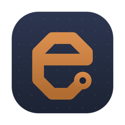

<p align="center">
  
</p>

<h1 align="center">etchable</h1>

<p align="center">
  A friendly little tool for designing circuit boards.<br />
  Sketch your idea, route your traces, etch what matters.
</p>

<p align="center">
  <a href="https://etchable.net">etchable.net</a> ·
  <a href="https://github.com/etchable/etchable/releases">Releases</a> ·
  <a href="docs/development.md">For developers</a>
</p>

---

Your board lives in plain [Zener](https://github.com/diodeinc/pcb) (`.zen`)
files in a git repo. etchable opens them as a live schematic you can pan,
zoom, and click — and pairs the canvas with a built-in agent that edits the
source for you. Change a file in your editor and the canvas re-renders.
Ask for a change in chat and the agent writes it, with your approval on
every edit.

- **See it.** The schematic is derived straight from your source — open a
  board and it's on the canvas, updating live as files change, with errors
  and warnings collected in a Problems panel.
- **Point at it.** Select parts or nets on the canvas and they become
  context for your next prompt — "make this divider 10k" needs no paths or
  reference designators.
- **Change it.** The agent edits your `.zen` files and the canvas follows.
  Every file edit asks first, inline in the chat.

## Install

With [Homebrew](https://brew.sh):

```sh
brew install --cask etchable/etchable/etchable
```

Or download the `.dmg` from the [latest release](https://github.com/etchable/etchable/releases/latest).

You'll need:

- A Mac with Apple Silicon, running macOS 13 or newer
- [Claude Code](https://claude.com/claude-code) installed and signed in —
  etchable drives the `claude` command on your behalf

## Your first board

1. Open etchable and click **Open board…**, or paste a path to any `.zen`
   file.
2. The first build of a board fetches its parts libraries into
   `~/.pcb/cache` — later builds are fast.
3. Click a part, then ask for what you want in the chat. Approve the edit
   and watch the canvas update.

New to Zener? A small demo board ships in this repo at
`examples/demo/board.zen`, and the [pcb project](https://github.com/diodeinc/pcb)
documents the language.

## Early days

etchable is young and moving fast. Schematics render with net labels rather
than routed wires, multi-board projects aren't there yet, and the rough
edges list is honest — see [status and limits](docs/development.md#status-vs-plan).
Found something broken? [Open an issue](https://github.com/etchable/etchable/issues).

## License

[MIT](LICENSE)
